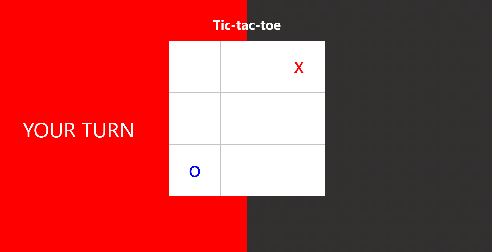
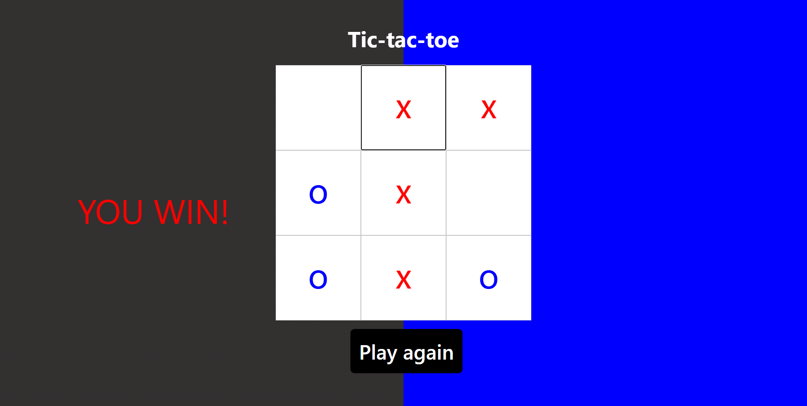

# Tic-Tac-Toe Game 🎮

**Tic-Tac-Toe** is a simple game built using **React** and bundled with **Vite**. This project demonstrates basic React hooks (`useState`, `useEffect`) and modular component structure, with a dynamic background and gameplay mechanics.

## Screenshots 📸

Below are some screenshots of the **Tic-Tac-Toe** game in action:




## Features ✨

- **Interactive Gameplay**: Players can take turns to place their mark (`X` or `O`) on the 3x3 grid.
- **Dynamic Background**: Background changes color based on the current player's turn (`X` is red, `O` is blue).
- **Winner Detection**: The game detects when a player has won or if there’s a tie.
- **Reset Button**: Restart the game after a win or tie.

## How to Play 📋

1. The game starts with Player X's turn.
2. Click on any square to place your mark (`X` or `O`).
3. Players take turns until:
   - One player wins by aligning 3 marks horizontally, vertically, or diagonally.
   - All squares are filled, resulting in a tie.
4. If there is a winner or a tie, you can restart the game by clicking the **"Reset"** button.

## Installation ⚙️

To run **Tic-Tac-Toe** locally, follow these steps:

1. Clone the repository:
   ```bash
   git clone https://github.com/Bimai6/Tic-tac-toe.git
   ```
2. Navigate to the project directory:
  ```bash
  cd Tic-tac-toe/
  ```
3. Install dependencies:
   ```bash
   npm install
   ```
4. Run the development server:
  ```bash
  npm run dev
  ```
  Then open your browser and go to http://localhost:5173.

## Scripts 📝

Here are the available scripts in the project:

- `npm run dev`: Starts the development server.
- `npm run build`: Builds the project for production.
- `npm run preview`: Previews the production build.

## Technologies Used 💻

- **React**: A JavaScript library for building user interfaces.
- **Vite**: A fast development build tool and bundler.
- **Node.js & npm**: For dependency management and running scripts.

## Future Improvements 🚀

- Add support for multiplayer over a network.
- Implement an AI opponent for single-player mode.
- Add animations for better visual feedback.
- Mobile-friendly layout enhancements.

## Contributing 🤝

Contributions are welcome! Please fork the repository and submit a pull request with your changes.

## License 📜

This project is licensed under the MIT License. See the `LICENSE` file for details.
